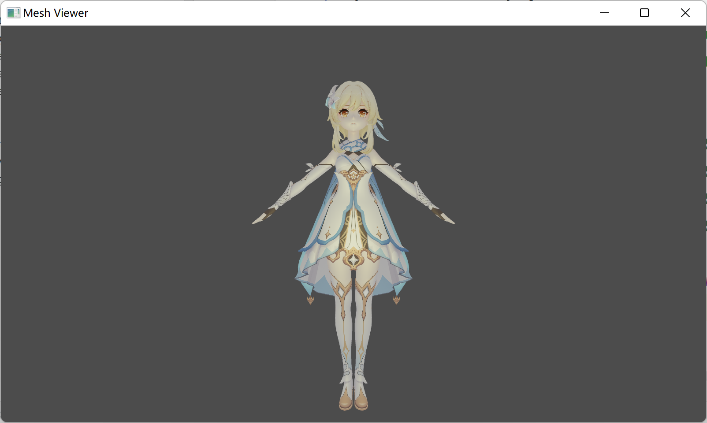

# Mesh-Viewer

A C++/OpenGL mesh viewer for OBJ format models.

## Features

This application allows you to view 3D models in OBJ format with different materials & light models.

Under development, new features are on the way ;)

**Camera:**

- WASD for close-far and left-right movement
- Mouse drag for rotation
- Mouse scroll for zoom

**Rendering:**

- Constant ambient light
- Blinn-Phong
  - Gamma Correction
  - HDR Tone Mapping

Besides the predefined shaders, you can add custom shaders in `src/shader` directory and use it in the code.

**Model:**

- OBJ file for mesh vertices, normals and UVs
- MTL file for materials

An example model of Lumine (Genshin Impact) is attached in `resource/lumine` directory. You can add custom models and load it in the code.

## Build & Run

This project is configured for Windows 11 64-bit & MSVC 2022. If you are using a different toolchain or platform, the `CMakeList.txt` may not work normally on your environment.

- `mkdir build && cd build`
- `cmake ..`
- Open `Mesh-Viewer.sln` and build project in Visual Studio.
- Find binaries in `Release` directory.

Currently, shader & resource path is hard-coded in `main.cpp`, so the `Mesh-Viewer.exe` file should be placed at a `bin` directory, along with `src/shader` and `resource` directory. Please refer to [the v0.1 release pack](https://github.com/KSkun/Mesh-Viewer/releases/download/v0.1/Mesh-Viewer_0.1_win64.zip).

## Resources

### 3rd Party Libraries

- Glad, Multi-Language GL/GLES/EGL/GLX/WGL Loader-Generator based on the official specs, https://glad.dav1d.de/
- GLFW, an Open Source, multi-platform library for OpenGL, OpenGL ES and Vulkan development on the desktop, https://www.glfw.org/
- GLM, a header only C++ mathematics library for graphics software based on the OpenGL Shading Language (GLSL) specifications, https://github.com/g-truc/glm
- Plog, portable, simple and extensible C++ logging library, https://github.com/SergiusTheBest/plog
- OBJ-Loader, a simple, header only, .obj model file loader, https://github.com/Bly7/OBJ-Loader
- stb, single-file public domain (or MIT licensed) libraries for C/C++, https://github.com/nothings/stb

### Models

- Lumine (Genshin Impact), OBJ 3D Model, https://www.models-resource.com/pc_computer/genshinimpact/model/45957/